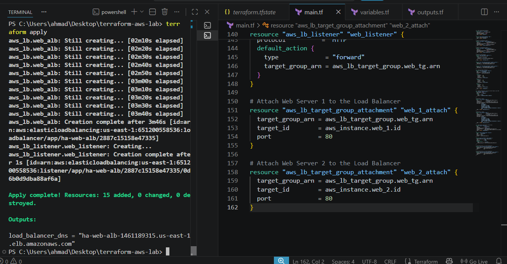
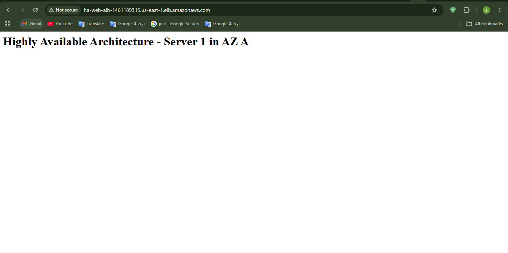
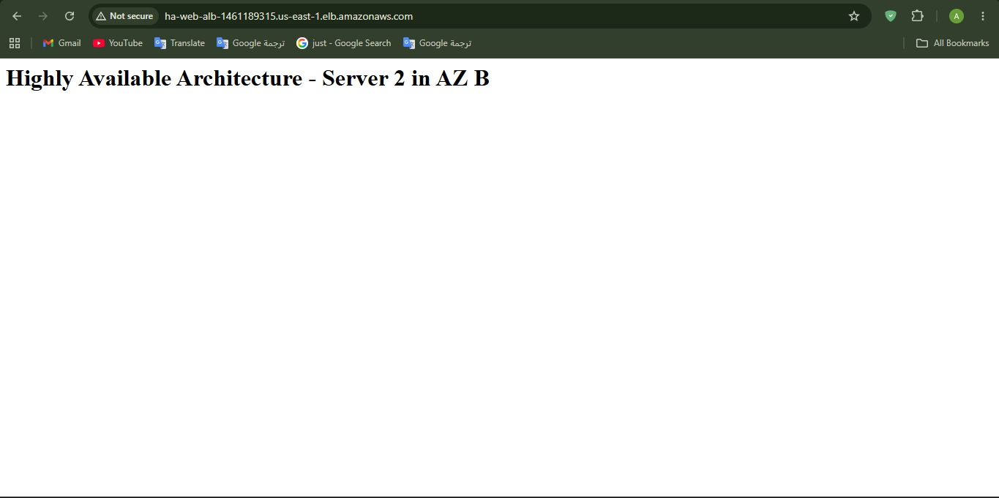
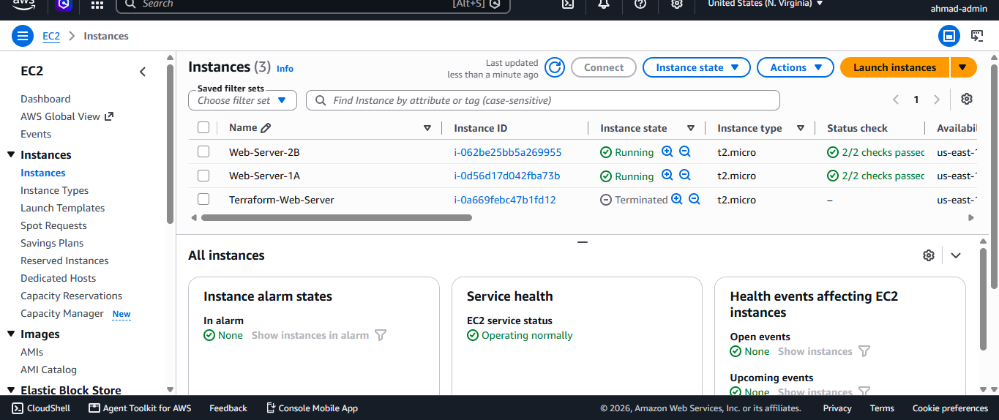
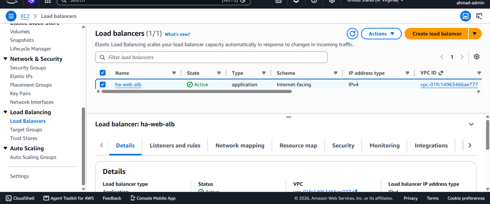
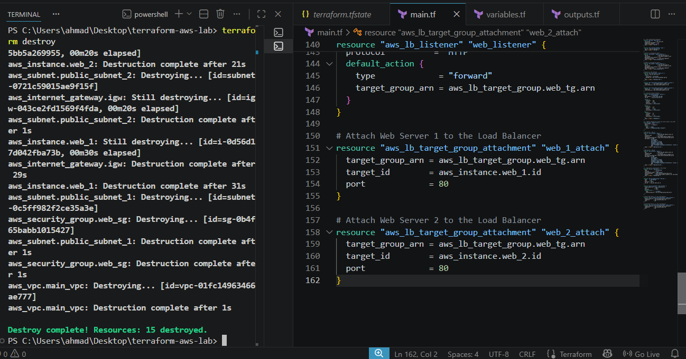

# ☁️ Highly Available AWS Web Architecture via Terraform

### 📌 Project Overview
This project demonstrates the design and automated deployment of a **Highly Available (HA), Multi-AZ Web Architecture** on Amazon Web Services (AWS) using **Terraform (Infrastructure as Code)**. 

Moving beyond single-instance deployments, this lab showcases production-grade cloud engineering practices by decoupling configurations into variable files, provisioning infrastructure across multiple Availability Zones, and utilizing an Application Load Balancer (ALB) to distribute active web traffic dynamically.

---

### 🏗️ Technical Architecture & Implementations

#### 1. Custom Virtual Private Cloud (VPC) & Subnetting
* Engineered a custom VPC (`10.0.0.0/16`) to isolate the application environment.
* Provisioned two distinct Public Subnets (`10.0.1.0/24` and `10.0.2.0/24`) mapped to separate Availability Zones (`us-east-1a` and `us-east-1b`) to ensure fault tolerance.
* Configured an Internet Gateway (IGW) and custom Route Tables for public egress.

#### 2. Scalable Compute & Automation
* Utilized Terraform **Data Blocks** to programmatically fetch the latest Amazon Linux 2023 AMI.
* Deployed twin EC2 `t2.micro` instances across the separate subnets.
* Bootstrapped both instances using custom **User Data bash scripts** to automatically install Apache (`httpd`) and generate unique HTML identifiers for load-balancing validation.

#### 3. Application Load Balancing (ALB)
* Provisioned an internet-facing Application Load Balancer.
* Created a Target Group and configured HTTP (Port 80) listeners to actively route incoming traffic.
* Successfully validated cross-zone load balancing by observing traffic alternating between Server 1 (AZ A) and Server 2 (AZ B).

#### 4. Security & Lifecycle Management
* Centralized infrastructure variables (`variables.tf`) to avoid hardcoded dependencies and improve code scalability.
* Implemented a unified EC2 Security Group acting as a stateful firewall for inbound HTTP/SSH traffic.
* Validated proper cloud lifecycle hygiene by actively managing state and executing `terraform destroy` upon lab completion.

---

### 📂 File Structure
* `main.tf` — The core infrastructure declarations (VPC, Subnets, ALB, EC2, Security Groups).
* `variables.tf` — Centralized definitions for AWS regions and CIDR blocks.
* `outputs.tf` — Automated CLI outputs, strictly returning the dynamic ALB DNS endpoint upon successful apply.

---

### 📊 Deployment & Load Balancing Validation

*Screenshots demonstrating the automated lifecycle and active traffic distribution:*

**1. Infrastructure Provisioning & CLI Outputs**

**2. Active Application Load Balancing (Traffic Routing across AZs)**

**3. AWS Console Verification (EC2 & ALB)**

**4. Teardown & Cost Management**

